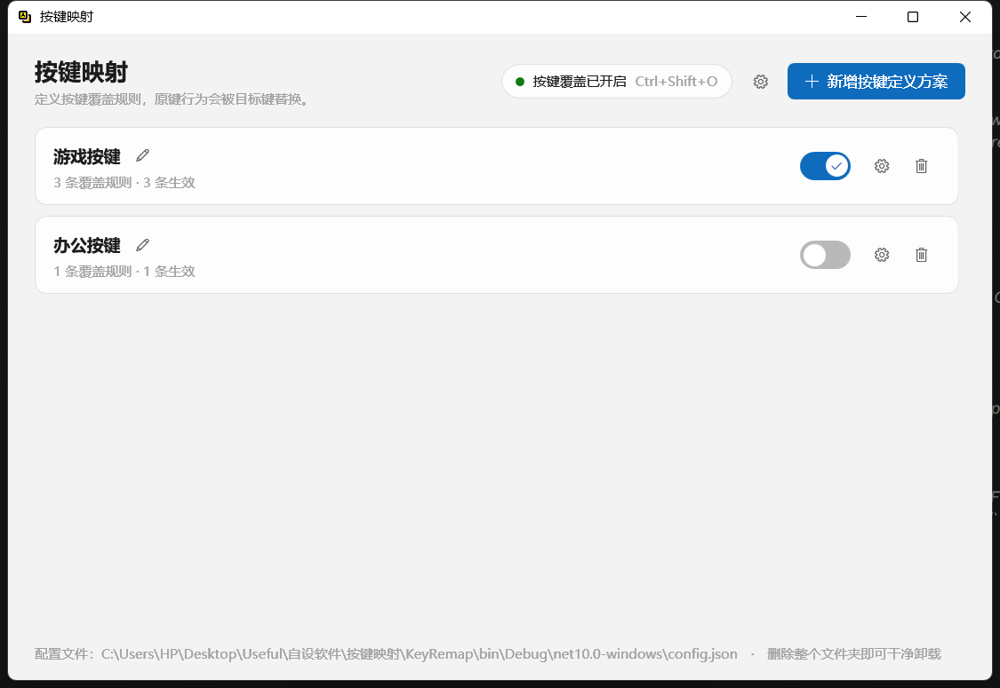
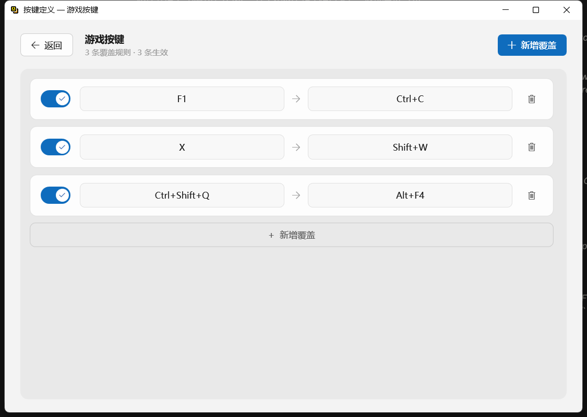
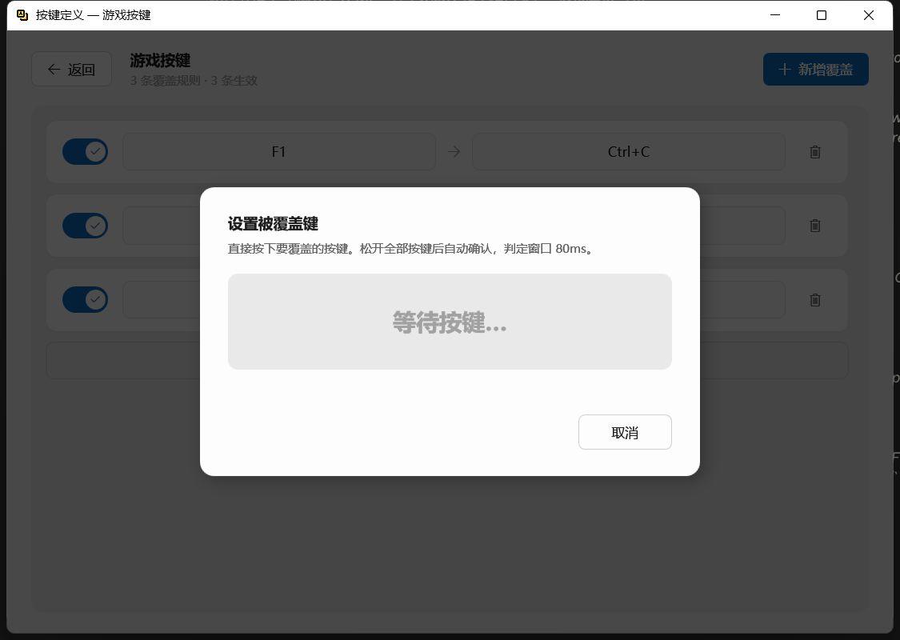
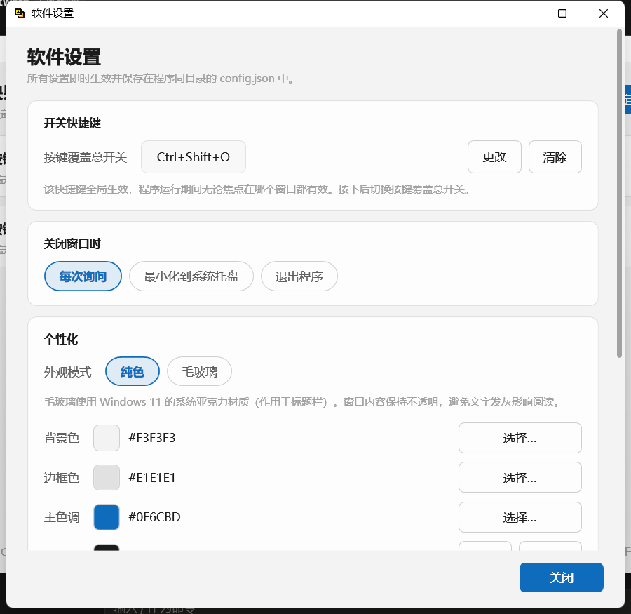
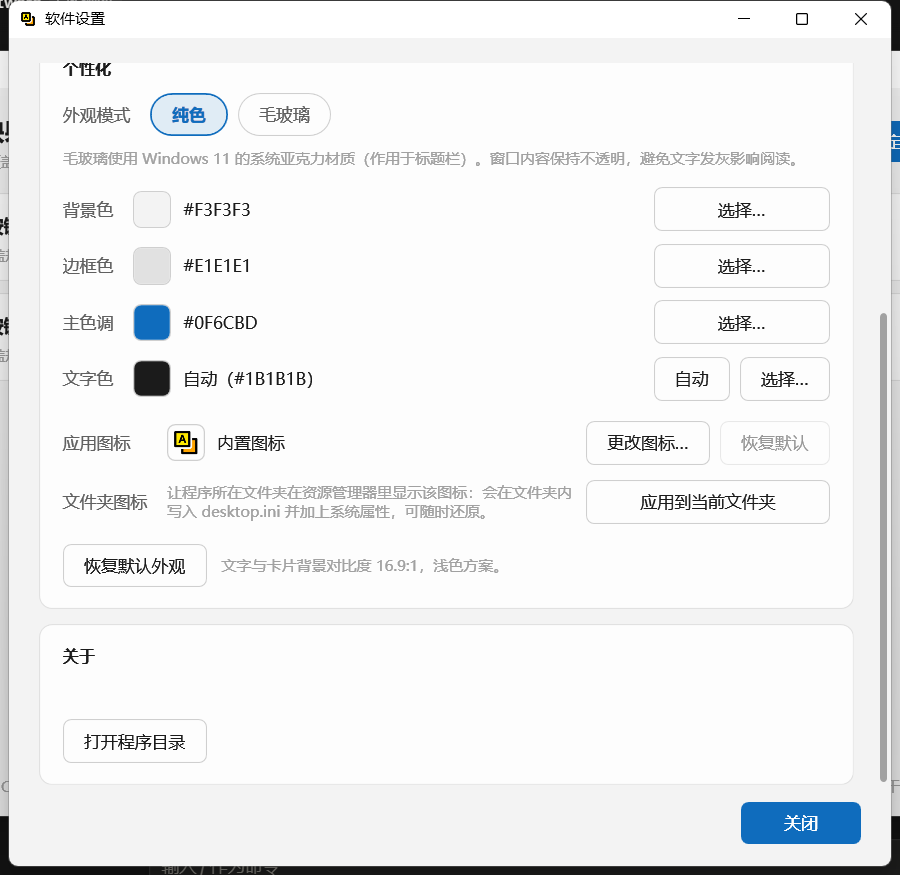
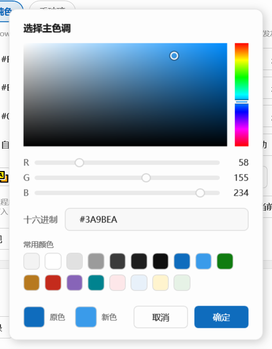
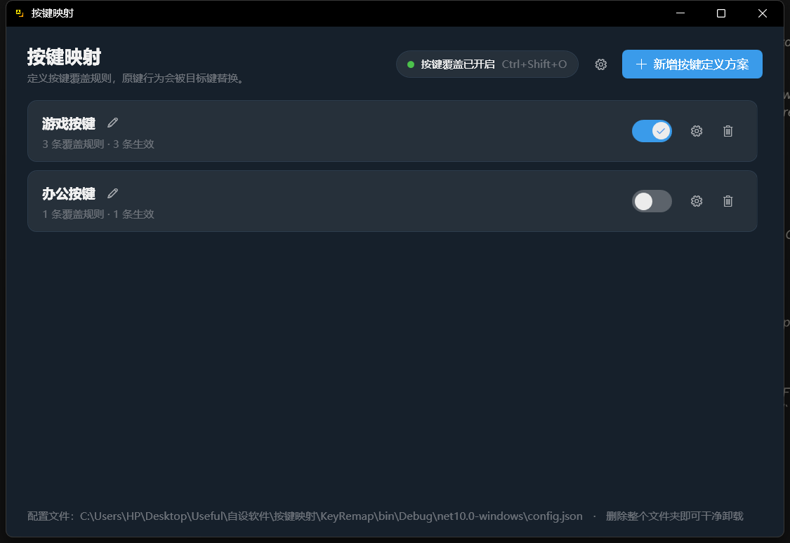

# 按键映射

轻量、绿色便携的 Windows 按键重映射工具。定义「按下某个键或组合键 → 输出另一个键或组合键」，原键行为被覆盖。

配置全部保存在程序同目录，不写注册表、不写 AppData，删掉整个文件夹即可干净卸载。

> 目标平台：Windows 10 / 11（x64）　·　技术栈：C# + WPF (.NET 10)



---

## 目录

- [特性](#特性)
- [运行环境](#运行环境)
- [快速开始](#快速开始)
- [使用说明](#使用说明)
- [配置文件](#配置文件)
- [自定义图标](#自定义图标)
- [项目结构](#项目结构)
- [已知限制与设计取舍](#已知限制与设计取舍)

---

## 特性

### 按键重映射

- **单键或组合键**映射为单键或组合键，原键事件被拦截，不会传给系统和前台程序
- **无序匹配**：`Ctrl+A`、`A+Ctrl`、几乎同时按下，都识别为同一个组合键
- **修饰键仍参与区分**：按住 Shift 再按 A 走的是 `Shift+A`，不会误触发 `A` 的规则；但手上按着一个与规则无关的键（比如 X）时，规则**不会**因此失效
- **精确优先**：`A→B` 与 `Ctrl+A→X` 同时存在时，按住 Ctrl 按 A 命中更具体的 `Ctrl+A`
- **目标键可以包含被覆盖键**：`A → Ctrl+A`、`A → A+B` 都允许（只禁止 `A → A` 这种完全相同的）
- **不连锁触发**：`P→A` 与 `A→B` 同时启用时，按 P 输出 A，不会再触发 A→B
- **左右修饰键等价**：左 Ctrl 与右 Ctrl 都记为 Ctrl
- **长按会重复**：按住被映射的键，目标键跟着连续触发

### 方案与规则

- 多套**方案**（Profile），可分别启用 / 禁用
- 单个方案内多条**覆盖规则**，也可分别启用 / 禁用
- **四态状态机**：启用 / 禁用 / 启用失效 / 禁用失效
  - 方案内没有任何规则、或存在失效规则时，方案整体失效
  - 失效时开关不可点击，显示失效图标
  - **失效期间启用意图会保留**，恢复后回到原状态
  - 规则失效后会强制禁用，恢复时变为「禁用」（不自动变回启用）
- 新增方案自动取当前未占用的最小序号命名（`按键方案1`、`按键方案2`…），重名会被拒绝
- 删除方案 / 删除规则都有二次确认



### 键位选择模式

点击「被覆盖键」或「目标键」显示区即可进入录制：

- 实时显示当前按下的键
- **80ms 松开判定窗口**：人无法真正同时松开所有键，最后一个键松开后仍保留一小段判定时间
- 结果取**最后一次按下那一瞬间仍被按住的键**——中途按过又放开的键不会赖在结果里
- 不支持的键仍会显示名称和原因
- 被覆盖键不支持：`Esc`、`Caps Lock`、`Fn`、开关快捷键、本方案内已用过的组合键
- 无效虚拟键码会被拒绝（例如某些键盘把 `Fn` 上报成 `0xFF`、Unicode 输入包 `VK_PACKET`、鼠标键）
- 目标键不能与本条规则的被覆盖键完全相同



### 总开关与全局快捷键

- 默认 `Ctrl+Shift+O`，全局生效，程序运行期间无论焦点在哪个窗口都有效
- 快捷键**可修改、可清除**（清除即关闭该快捷键）
- 切换时会中和已经放行的修饰键，前台程序感知不到这次按键
- 总开关状态会持久化



### 托盘与关闭行为

- 系统托盘图标，右键菜单：显示主界面 / 暂停或恢复按键覆盖 / 退出
- 双击托盘图标唤回窗口
- 关闭窗口的行为三选一：**每次询问 / 最小化到系统托盘 / 退出程序**
- 首次关闭会弹窗询问，可以记住选择，之后在软件设置里随时改

### 个性化

- **背景色、边框色、主色调**可自定义，RGB 色盘取色（色相条 + 饱和度明度方块 + RGB 滑杆 + 十六进制输入 + 预设色板 + 原色/新色对比）
- **文字色**可覆盖为指定颜色，也可保持「自动」
- 只配三个颜色，其余 24 个画刷全部由程序推导
- **深色 / 浅色自动适配**：按背景亮度自动切换文字明暗，选深色背景时文字自动变浅
- 显示文字与卡片背景的 **WCAG 对比度**，过低时给出提示
- **毛玻璃**：使用 Windows 11 系统亚克力材质（见[已知限制](#已知限制与设计取舍)）
- **应用图标**可更换：选任意图片（png / jpg / bmp / gif / ico），自动转成多尺寸 ICO
- **文件夹图标**可更换：让程序所在文件夹在资源管理器中显示该图标

| 个性化设置 | RGB 色盘 | 深色主题效果 |
| --- | --- | --- |
|  |  |  |

### 绿色便携

- 数据只写在程序同目录：`config.json`、`app-icon.ico`、`desktop.ini`
- 不写注册表、不写 AppData、不写系统目录
- 不需要管理员权限
- **单实例**：重复启动会提示已有一个实例在运行
- 配置**原子写入**（先写临时文件再替换），损坏时自动备份为 `config.json.bak` 并重建默认配置
- 发布为**自包含单文件 exe**，目标机器无需安装 .NET 运行时

---

## 运行环境

| | |
|---|---|
| 使用 | Windows 10 / 11（x64），无需安装任何运行时 |
| 构建 | .NET 10 SDK（`dotnet --list-sdks` 可查） |
| 毛玻璃 | 需要 Windows 11；在 Windows 10 上会自动退化为纯色背景 |

---

## 快速开始

### 直接使用

从 Releases 下载 `按键映射.exe`，放到任意文件夹双击运行。它就是完整程序，不需要安装。

### 从源码构建

调试运行：

```bash
dotnet run --project KeyRemap/KeyRemap.csproj
```

发布便携版（自包含单文件）：

```bash
dotnet publish KeyRemap/KeyRemap.csproj -c Release -r win-x64 --self-contained true -o publish
```

Windows 上也可以直接双击仓库根目录的 `发布便携版.bat`。

> **发布前记得关掉正在运行的程序。** 程序关窗后可能还在托盘里，占用着 `publish\按键映射.exe`，会导致覆盖失败。

---

## 使用说明

1. 点右上角**新增按键定义方案**，创建一个方案
2. 点方案行上的**设置**按钮进入按键定义界面
3. 点**新增覆盖**添加一条规则，然后点击规则里的「被覆盖键」和「目标键」显示区，按下实际按键完成录制
4. 规则设置完整后自动变为「禁用」，点开关启用它
5. 回到主界面，点方案开关启用整个方案

一条规则真正生效需要同时满足：

- 按键覆盖总开关是开的
- 所属方案是启用且有效的
- 该规则本身是启用且有效的

> 覆盖在本程序窗口获得焦点时会自动暂停，否则就没法在重命名框里输入字母了。切到其它窗口即恢复。

---

## 配置文件

`config.json` 就在 exe 旁边，可以手工编辑：

```json
{
  "CoverageEnabled": true,
  "CoverageToggleHotkey": [16, 17, 79],
  "HotkeyDisabled": false,
  "CloseBehavior": 0,
  "Theme": {
    "Background": "#F3F3F3",
    "Border": "#E1E1E1",
    "Accent": "#0F6CBD",
    "Appearance": 0
  },
  "Profiles": [
    {
      "Id": "…",
      "Name": "按键方案1",
      "Enabled": true,
      "Rules": [
        { "Id": "…", "Enabled": true, "Source": [65], "Target": [17, 67] }
      ]
    }
  ]
}
```

| 字段 | 说明 |
|---|---|
| `CoverageToggleHotkey` | 快捷键的虚拟键码数组（`[16,17,79]` = Ctrl+Shift+O） |
| `HotkeyDisabled` | 为 `true` 表示用户主动关闭了快捷键 |
| `CloseBehavior` | `0` 每次询问 / `1` 最小化到托盘 / `2` 退出程序 |
| `Theme.Appearance` | `0` 纯色 / `1` 毛玻璃 |
| `Theme.Text` | 文字色，省略表示自动推导 |
| `Source` / `Target` | 虚拟键码数组，省略表示未设置 |

左右修饰键会被归一化（左右 Ctrl 都是 `17`，左右 Shift 都是 `16`）。生效状态（`Valid`）由程序推导，不写进文件。

---

## 自定义图标

分三个层次，互不影响：

| 想改什么 | 怎么做 | 何时生效 |
|---|---|---|
| 程序运行时的**窗口标题栏 / 托盘**图标 | 软件设置 →「更改图标…」，接受 png / jpg / bmp / gif / ico，会自动转成多尺寸 ICO | 立即 |
| **exe 文件本身**的图标 | 替换 `KeyRemap/Assets/app.ico` 后重新编译 | 编译后 |
| 程序所在**文件夹**的图标 | 软件设置 →「应用到当前文件夹」 | 立即 |

几个容易踩的坑：

- **`.ico` 不是改后缀就能用的。** 它是有固定二进制结构的容器（头 6 字节 `00 00 01 00`）。把 png 改名成 `.ico` 会让编译直接报 `CS7065：图标流不是预期格式`。用软件里的「更改图标…」转换，或用支持多尺寸 ICO 的工具导出。
- **编译是增量的，按时间戳判断。** 如果替换进去的文件时间戳比上次编译产物还旧，MSBuild 会认为没有变化而跳过编译，表现就是「改了图标但编译后没变」。删掉 `KeyRemap/obj` 或加 `-t:Rebuild` 可以强制全量重编。
- **资源管理器会缓存文件图标。** 覆盖同名 exe 后可能仍显示旧图标，这属于显示缓存，文件内容是对的。改个名字、挪个目录，或清一下 `%LOCALAPPDATA%\Microsoft\Windows\Explorer\iconcache*` 即可。
- 单个 100×100 的图标在小尺寸（16/32）下是缩放出来的，会偏糊；想清晰就做多尺寸 ICO（16/32/48/256 各一帧）。

---

## 项目结构

```
KeyRemap/
├─ App.xaml(.cs)              应用入口：单实例、配置加载、托盘、关闭行为
├─ MainWindow.xaml(.cs)       方案列表
├─ Views/
│  ├─ ProfileWindow           按键定义界面（规则列表）
│  └─ SettingsWindow          软件设置（快捷键 / 关闭行为 / 个性化 / 图标）
├─ Controls/
│  ├─ StateSwitch             四态 / 三态开关
│  ├─ CaptureOverlay          键位选择遮罩（方案窗口与设置窗口共用）
│  ├─ ColorPickerDialog       RGB 色盘
│  ├─ CloseChoiceDialog       关闭方式询问
│  ├─ ConfirmDialog           二次确认
│  └─ InputDialog             重命名输入
├─ Core/
│  ├─ KeyboardHook            WH_KEYBOARD_LL 底层钩子（独立线程）+ SendInput 注入
│  ├─ Native                  Win32 互操作
│  ├─ RemapEngine             重映射引擎：匹配、拦截、注入
│  ├─ RemapPlan               匹配与注入决策（纯函数，便于测试）
│  ├─ CaptureBuffer           键位选择的和弦计算（纯状态）
│  ├─ CaptureSession        键位选择的 80ms 判定窗与超时保护
│  ├─ KeyNames / KeyCombo     虚拟键码、中文键名、组合键规范化
│  ├─ Rule / Profile / AppConfig / Hotkey    数据模型与校验
│  ├─ ConfigStore             config.json 原子读写与损坏恢复
│  ├─ Theme                   配色推导（颜色 → 24 个画刷）
│  ├─ WindowEffects           DWM 系统材质与深色标题栏
│  ├─ IconService             图标转换与加载
│  ├─ FolderIcon              文件夹图标（desktop.ini）
│  └─ TrayIcon                托盘图标与菜单
├─ Themes/Styles.xaml         圆角现代样式
└─ Assets/app.ico             应用图标
需求.txt                       最初的需求规格说明书
发布便携版.bat                 一键发布便携版
```

---

## 已知限制与设计取舍

**按需求明确不做的**

- 不做连锁触发
- 不做宏录制、鼠标映射、脚本
- 不支持 `Esc`、`Caps Lock`、`Fn` 作为被覆盖键

**实现上的取舍**

- **毛玻璃只作用于标题栏，窗口内容保持不透明。** 试过把 DWM 材质铺满整窗，但那样 DWM 会按固定不透明度混合整个窗口，所有面板都会发灰、文字发虚——WPF 提供不了整窗云母所需的逐像素 alpha。Windows 10 上会自动退化为纯色。
- **本程序窗口获得焦点时覆盖暂停**。不这样做的话，设了 `A→B` 之后就没办法在重命名框里输入字母 A。
- **注入使用虚拟键码 + `SendInput`**。绝大多数程序都能收到，但少数使用独占原始输入的游戏可能忽略注入事件。
- **覆盖暂停期间是「全局」的**：进入键位选择模式或按下总开关快捷键时，所有规则临时不拦截。

**尚未验证的**

- 真实键盘的时序表现（自动重复间隔、快速连按、边按边切前台窗口）只在逻辑层做了测试，实际手感需要真机确认。
- 少数程序（尤其是独占全屏游戏）对注入事件的接受程度。

---

## 许可证

尚未指定。如果你打算让他人自由使用，建议补一个（例如 MIT）。
